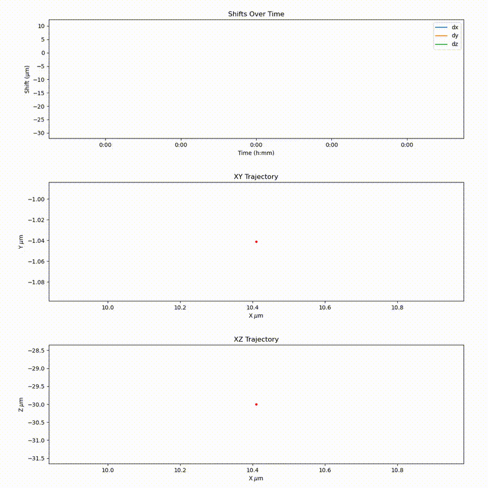

# lightsheet-live-tracking-tool

## Demo Videos
| Using Tracker predictions only| Using Detection and Sensor Fusion|
|:------------------------------:|:----------------------------------:|
|  |  |

| Shifts and Trajectories |
|:------------------------:|
|  |

## Installation

### Recommended Python Version
> Python **3.10.16** or higher is recommended.

---

### Create a Virtual Environment

```bash
cd path/to/live/tracking/tool
python -m venv tracking-tool-venv
source tracking-tool-venv/bin/activate  # On Windows: tracking-tool-venv\Scripts\activate
```

---

### Install Requirements

```bash
pip install -r requirements.txt
```

---

### Install PyTorch

PyTorch is not included in the `requirements.txt` file because it depends on your system (CPU vs GPU, CUDA version, etc...)

Follow the official installation instructions tailored to your setup:  
🔗 [https://pytorch.org/get-started/locally](https://pytorch.org/get-started/locally)


## Using `live-tracking-tool` with PyMCS

If you are using a **Viventis microscope**, an integration with **PyMCS** is available.

To use this integration:

1. Copy the `run_tracking.py` script from this repository into the `scripts/` folder of your PyMCS installation.
2. ```bash
    cd path/to/live/tracking/tool
    source tracking-tool-venv/bin/activate  # On Windows: tracking-tool-venv\Scripts\activate
    python path/to/PyMCS/scripts/run_tracking.py path/to/PyMCS
    ```
> Running the script will start a GUI similar to the other PyMCS scripts.


## Using `live-tracking-tool` Without PyMCS

You can use **`live-tracking-tool`** *without* the PyMCS integration by creating your own **microscope interface**.  

The microscope interface is responsible for linking the tracking output to your microscope's commands. You can find the base class and implementation here: [`MicroscopeInterface.py`](tracking_tools/microscope_interface/MicroscopeInterface.py)

A ready-to-use **`SimulatedMicroscopeInterface`** is available for running **offline tracking** without hardware.

If your image format or file naming differs from the default setup, you can also create your own image reader in:  [`ImageReader.py`](tracking_tools/image_reader/ImageReader.py)

To start tracking:

1. Create a `TrackingRunner` instance with your tracking config.
2. Call its `.run()` method.

You can find a working example in the [**Examples section**](#example).

## Interactive visualizations

This project provides two interactive tools to support the tracking workflow. Both tools are available in the [`interactive-tools`](interactive-tools) directory:

### 1. **ROI Selection Tool – `bokeh_selection.py`**
Used to **initialize the Regions of Interest (ROIs)** before tracking begins. This script allows you to manually select the areas in the image where tracking should occur. 
>  This step is **required** to set up the tracking process.
```bash
cd path/to/live/tracking/tool
source tracking-tool-venv/bin/activate  # On Windows: tracking-tool-venv\Scripts\activate
python interactive_tools bokeh_selection.py
```


### 2. **Tracking Monitor – `bokeh_visualization.py`**

Used to **monitor the tracking process** in real-time. It visualizes current tracking data.

> This tool is **optional** and is meant for live monitoring only.
```bash
cd path/to/live/tracking/tool
source tracking-tool-venv/bin/activate  # On Windows: tracking-tool-venv\Scripts\activate
python interactive_tools bokeh_visualization.py
```

## Remote GPU

Remote GPU execution is supported using the [`imaging-server-kit`](https://github.com/Imaging-Server-Kit) package.

### Setting Up the Server

To run the server:

1. Install `imaging-server-kit` version **0.0.12** or higher on the remote machine.
    ```bash
    pip install imaging-server-kit==0.0.12
    ```
2. Ensure that the machine has a compatible **PyTorch** installation.
3. Run the main server script (**[file coming soon]**) on the GPU-enabled machine.

> The default port is **8000**.

---

### Configuring the Client

To access the remote GPU server from your local machine:

- In your `TrackingRunner` configuration, set the server address (e.g., `http://192.168.1.10:8000`) to point to the remote machine.

Once configured, all model inference will be offloaded to the remote GPU server.

A usage example is available in the [**Examples section**](#example).

## Example
Coming soon
