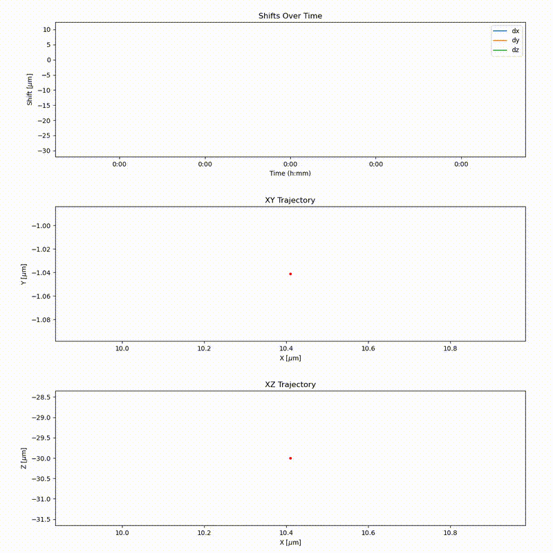

# lightsheet-live-tracking-tool

## Demo Videos
| Using Tracker predictions only| Using Detection and Sensor Fusion|
|:------------------------------:|:----------------------------------:|
|  |  |

| Shifts and Trajectories |
|:------------------------:|
|  |


| 2D multi-ROIs |
|:------------------------:|
|  |


## Installation

### Recommended Python Version
> Python **3.10.16** or higher is recommended.

---

### Create a Virtual Environment

```bash
cd path/to/live/tracking/tool
python -m venv tracking-tool-venv
source tracking-tool-venv/bin/activate  # On Windows: tracking-tool-venv\Scripts\activate
```

---

### Install Requirements

```bash
pip install -r requirements.txt
```

---

### Install PyTorch

PyTorch is not included in the `requirements.txt` file because it depends on your system (CPU vs GPU, CUDA version, etc...)

Follow the official installation instructions tailored to your setup:  
🔗 [https://pytorch.org/get-started/locally](https://pytorch.org/get-started/locally)

## Using `live-tracking-tool`

You can use **`live-tracking-tool`** on your system by creating your own **microscope interface** and **tracking runner** loop.  

The **microscope interface** is responsible for retrieving images and linking the tracking output to your microscope’s control commands. You can find implementation examples in [`MicroscopeInterface.py`](tracking_tools/microscope_interface/MicroscopeInterface.py) and [`TrackingRunner.py`](tracking_tools/tracking_runner/TrackingRunner.py).  

Several implementations are already provided, including:  
- **Viventis LS1 implementation** – supports both **online** and **offline (simulated microscope)** tracking.  
- **General implementation** – for **offline** use.  

These examples can serve as templates for adapting the tracking tool to your own microscope system. 
> Only the "relative_move" function needs to be defined as such in the microscope interface.

You can find a working example of the whole process [`example.py`](example.py).

### Folder Architecture

This tool expects the experiment data to follow a consistent folder structure.  
Each experiment should contain one or more **position folders**, each holding the corresponding image sequence to be tracked.

```text
experiment_folder/
├── Position_1/
│   ├── img_0001.tif
│   ├── img_0002.tif
│   ├── ...
│
├── Position_2/
│   ├── img_0001.tif
│   ├── img_0002.tif
│   ├── ...
```
- Each "Position" folder corresponds to a acquisition in your experiment.
- The tool processes each Position independently.

## Using `live-tracking-tool` with PyMCS

An integration with **PyMCS** for the **Viventis LS1 microscope** is available.

1. Copy the `run_tracking.py` script from this repository into the `scripts/` folder of your PyMCS installation.
2. ```bash
    cd path/to/live/tracking/tool
    source tracking-tool-venv/bin/activate  # On Windows: tracking-tool-venv\Scripts\activate
    python path/to/PyMCS/scripts/run_tracking.py path/to/PyMCS
    ```
> Running the script will start a GUI similar to the other PyMCS scripts.

## Interactive visualizations

This project provides two interactive tools to support the tracking workflow. Both tools are available in the [`interactive_tools`](interactive_tools) directory:

### 1. **ROI Selection Tool – `bokeh_selection.py`**
Used to **initialize the Regions of Interest (ROIs)** before tracking begins. This script allows you to manually select the areas in the image where tracking should occur. 
>  This step is **required** to set up the tracking process.
```bash
cd path/to/live/tracking/tool
source tracking-tool-venv/bin/activate  # On Windows: tracking-tool-venv\Scripts\activate
python interactive_tools/bokeh_selection.py
```


### 2. **Tracking Monitor – `bokeh_visualization.py`**

Used to **monitor the tracking process** in real-time. It visualizes current tracking data.

> This tool is **optional** and is meant for monitoring only.
```bash
cd path/to/live/tracking/tool
source tracking-tool-venv/bin/activate  # On Windows: tracking-tool-venv\Scripts\activate
python interactive_tools/bokeh_visualization.py
```

### 3. **Combined Interface - `panel_app.py`**

You can also run both tools simultaneously through a single interactive dashboard.
This combined interface provides access to ROI selection and tracking visualization in one place.
```bash
cd path/to/live/tracking/tool
source tracking-tool-venv/bin/activate  # On Windows: tracking-tool-venv\Scripts\activate
panel serve interactive_tools/panel_app.py --dev
```

## Local GPU
To run on a local GPU using the detection feature, the detector model weights must be placed at:

```bash
weights/*.pth
```
**Note**: The weights folder must contain only one .pth file, as the current implementation automatically loads the first match.

If you wish to use a different path for the weights, you can override the default location by setting the model_path parameter in your config.

## Remote GPU

Remote GPU execution is supported using the [`imaging-server-kit`](https://github.com/Imaging-Server-Kit) package.

### Setting Up the Server

To run the server:

1. Ensure that the machine has compatible **PyTorch** and **imaging-server-kit** installations.
2. Run the main server script [`serverkit_main.py`](serverkit_main.py) on the GPU-enabled machine.
3. If you connect through SSH, it is better to use a detached terminal like tmux to run [`serverkit_main.py`](serverkit_main.py).

> The server script defaults to using the detection model. Make sure the model weights are located in the same directory as the script.

> The default port is **8000**.

---

### Configuring the Client

To access the remote GPU server from your local machine:

- In your `TrackingRunner` configuration, set the server address (e.g., `http://192.168.1.10:8000`) to point to the remote machine.
- Set the `serverkit` parameter to `True`.

Once configured, all model inference will be offloaded to the remote GPU server.

